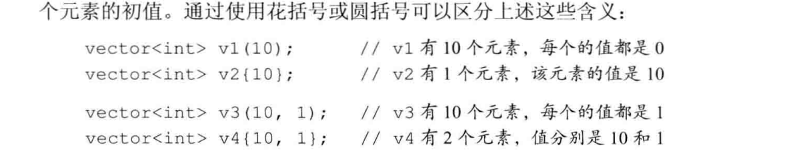

# 标准库类型vector

标准库类型vector表示对象的集合，其中所有对象的类型都相同。集合中的每个对象都有一个与之对应的索引，索引用于访问对象。因为vevtor“容纳着”其他对象，所以它也常被称作容器（container）

C++语言即有类模板（class templlate），也有函数模板，其中vector是一个类模板。目前先学习使用模板

模板本身不是类或函数，相反可以将模板看作为编译器生成类或函数编写的一份说明。编译器根据模板创建类或函数的过程称为实例化（instantiation），当使用模板时，需要指出编译器应把类或函数实例化成何种类型。

对于类模板来说，我们通过提高一些额外信息来指定模板到底实例化成什么样的类，需要提高那些信息有模板决定。提供信息的方式总是这样：即在模板名字后面跟一对尖括号，在括号内放上信息

以vector为例。提供的额外信息是vector内所存放对象的类型：

```cpp
vecotor<int> ivec;       // ivec保存int类型的对象
vector<Sales_item> Sales_vec; // 保存Sales_item类型的对象
vector<vector<sting>> file; // 该向量的元素是vector对象  老式的需要在两个>中间加空格，c++11标准及以后的不需要
```

## 定义和初始化vector对象

```cpp
#include <vector>
vector<T> v1         // v1是一个空vector，它潜在的元素是T类型的，执行默认初始化
vector<T> v2(v1)     // v2包含v1所有元素的副本  v2和v1两个vector对象 的类型必须相同
vector<T> v2 = v1    // 等价于v2(v1),v2中包含有v1所有元素的副本
vector<T> v3(n, val) // v3包含了n个重复的元素，每个元素的值都是val
vector<T> v4(n)      // v4包含了n个重复地执行了值初始化的对象
vector<T> v5{a,b,c...} // v5包含了初始值格数的元素，每个元素被赋予相应的初始值  列表初始化
vector<T> v5{a,b,c...} // 等价于vector<T> v5{a,b,c...}
```

### 列表初始化vector对象

用花括号括起来的0个或多个初始元素值被赋给vector对象：
`vetor<string> articles = {"a", "an", "the"}`
上述vector对象包含三个元素：第一个是字符串"a",第二个是字符串"an"，最后一个是字符串"the"

C++语言提供了几种不同的初始化方式。在大多数情况下这些初始化可以相互等价地使用，但也有例外的情况：

* 使用拷贝初始化（即使用=时）只能提供一个初始值
* 如果提供的是一个类内初始值，则只能使用开被初始化或使用花括号的形式初始化
* 如果提供的是初始元素值的列表，则只能把初始值都放在花括号里进行列表初始化，而不能放在圆括号里

### 创建指定数量的元素

可以用vector对象容纳的元素数量和所有元素的统一初始值来初始化vector对象：

```cpp
vector<int> ivec(10, -1);       // 10个int类型的元素，每个都被初始化为-1
vector<string> svec(10, "hi!");  // 10个string类型的元素，每个都被初始化为"hi!"
```

### 值初始化

通常情况下，可以只提供vector对象容纳的元素数量而不去用略去初始值。此时库会创建一个值初始化（value-initialized）的元素初值，并把它赋给容器中的所有元素。这个处置由vector对象中元素的类型决定。

如果vector对象的元素是内置类型，比如int，则元素初始值设为0。如果元素是某种类类型，比如string，则元素由类默认初始化：

```cpp
vector<int> ivec(10);   //10个元素，每个都初始化为0
vector<string> svec(10);  //10个元素，每个都是空的string对象
```

 <!-- 此路径表示图片和MD文件，处于同一目录 -->


## 向vector对象中添加元素

* push_back函数

push_back负责把一个值当成vector对象的尾元素"压到（push）"vector对象的"尾端（back）":

```cpp
vector<int> v2;     // 空vector对象
for (int i = 0; i != 100; ++i)
    v2.push_back(i);  //依次把整数值放到v2尾端
//循环结束后v2有100个元素，值从0到99
```

* 其他vector操作

```cpp
v.empty()      // 如果v不含有任何元素，返回真；否则返回假
v.size()        // 返回v中元素的个数
v.push_back()   // 向v的尾端添加一个值为t的元素
v[n]            // 返回v中第n个位置上元素的引用
v1 = v2         // 用v2中的元素的拷贝替换v1中的元素
v1 = {a, b, c...}   // 用列表中元素的拷贝替换v1中的元素
v1 == v2       // v1和v2相等，当且仅当他们的元素数量相同且对应位置的元素值都相同
v1 != v2
<, <=, >, >=     //以字典顺序进行比较
```

* 不能用下标方式添加元素
* 只能对确知已村组的元素执行下标操作

