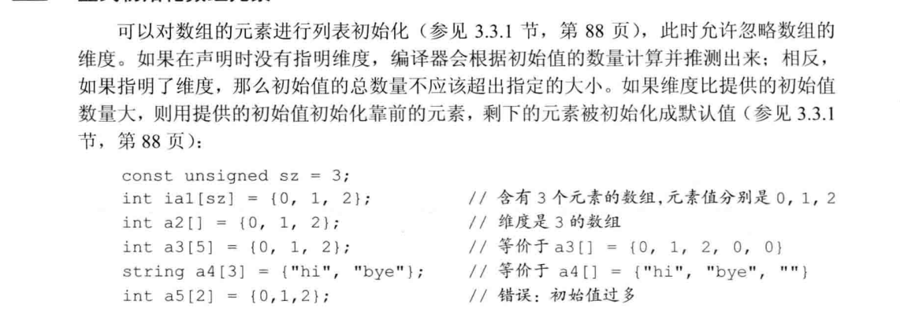
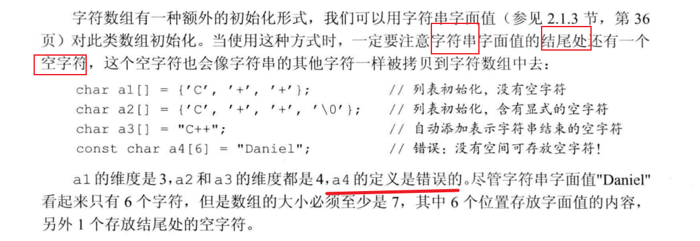
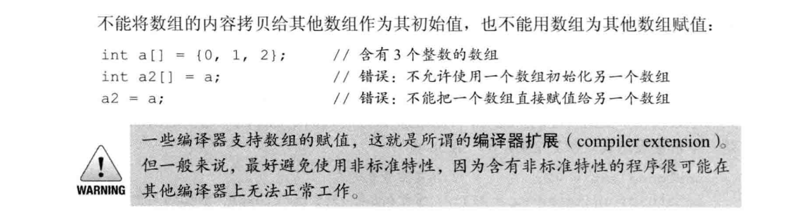
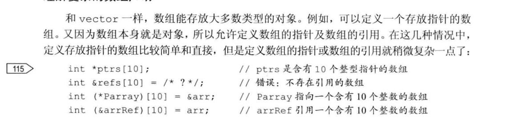
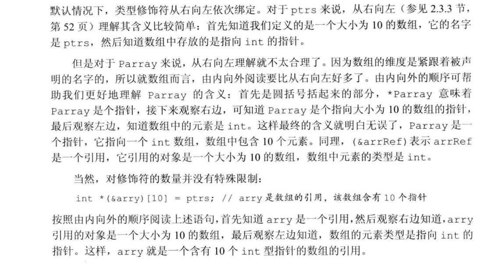

# 数组

## 定义和初始化内置数组

数组是一种负荷类型。数组的声明形如a[d]，其中a是啥机子的名字，d是数组的维度。维度说明了数组中元素的个数，因此必须大于0.数组中元素的个数也属于数组类型的一部分，编译的时候维度应该是已知的。也就是说，维度必须是一个常量表达式  
默认情况下，数组的元素被默认初始化。  
定义数组的时候ixu指定数组的类型，不允许用auto关键字有初始值的列表推断类型。另外和vector一样，数组的元素应为对象，因此不存在引用的数组。  

* 显式初始化数组元素

* 字符数组的特殊性

* 不允许拷贝和赋值

* 理解复杂的数组声明
  

## 访问数组元素

## 指针和数组

* 对数组元素使用取地址符就能得到指向该元素的指针
* 