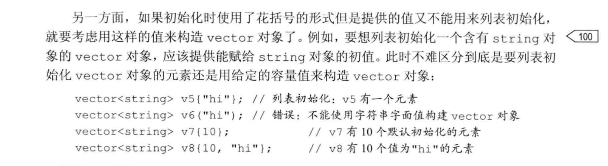
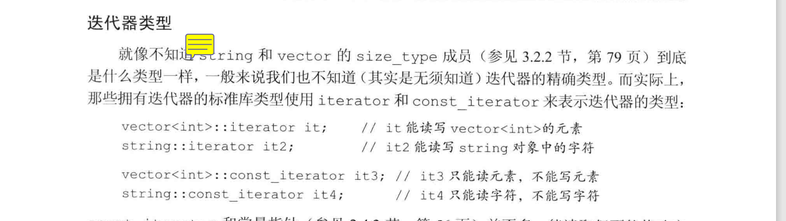

# 迭代器介绍

所有的标准库容器都可以使用迭代器，但是其中只有少数几种才同时支持下标运算符

## 使用迭代器

与指针不同，获取迭代器不是使用取地址符，有迭代器的类型同时拥有返回迭代器的成员

比如，这些类型都拥有`begin`和`end`的成员，其中begin成员负责返回指向第一个元素（或第一个字符）的迭代器。如有下述语句：

```c++
// 由编译器决定b和e的类型；
// b表示v的第一个元素，e表示v尾元素的下一位置
auto b = v.begin(), e = v.end(); // b和e的类型相同
```



* 标准容器迭代器的运算符

```c++
*iter               // 返回迭代器iter所指元素的引用
iter->mem           // 解引用iter并获取该元素的名为mem的成员，等价于(*iter).mem
(*iter).mem         // 等价于iter->mem
++iter              // 令iter指示容器中的下一个元素
--iter              // 令iter指示容器中的上一个元素
iter1 == iter2      // 判断两个迭代器是否相等（不相等），如果两个迭代器只是的时同一个元素或者他们时同一个容器的尾后迭代器，则相等；繁殖，不相等
iter1 != iter2
```

* 迭代器类型

* begin和end运算符

     begin和end返回的具体类型由对象是否是常量决定，如果对象是常量，begin和end返回const_iteator;如果对象不是常量，返回iterator

```cpp
vector <int> v;
const vector<int> cv;
auto it1 = v.begin(); // it1的类型是vector<int>::iterator
auto it2 = cv.begin(); // it2的类型是vector<int>::const_iterator
```

但有时我们不想要默认的类型。比如，在对象只需读操作而无需写操作的话最好使用常量类型（比如const_iterator）。为了便于专门得到const_iterator类型的返回值，C++11标准引入了两个新参数，分别是`cbegin`和`cend`

```cpp
auto it3 = v.cbegin(); // it3的类型是vector<int>::const_iterator
```

类似于`begin`和`end`,上述两个新韩淑也分别返回容器的第一个元素或最后元素下一位置的迭代器。有所不同的是，不论vector对象（或string对象）本身是否是常量，返回值都是const_iterator

* 结合解引用和成员访问操作

**解引用迭代器**可获得迭代器所指的对象，如果改对象的类型恰好是类，就有可能希望进一步访问它的成员。例如，有一个字符串组成的vector对象来说，要想检查其元素是否为空，令it是该vector对象的迭代器，只需检查it所指字符串是否为空就可以了：

```cpp
(*it).empty()
```

`(*it).empty()`中的圆括号必不可少，具体原因将在后续介绍。  
该表达式的含义是先对it解引用，然后解引用的结果在执行点运算符。如果不加圆括号，点运算百年不腐将有`it`来执行,而非`it`解引用的结果：

```cpp
(*it).empty()    // 解引用it，然后调用结果对象的empty成员
*it.empty()      // 错误，试图访问it的名未empty成员，但it是个迭代器，没有empty成员
```

上面第二个表达式的含义是从名未i的对象中寻找其empty成员，显然it是一个迭代器。它没有那个成员是叫empty的，所以第二个表达式将发生错误

**箭头运算符**（->）

为了简化上述表达式，C++语言定义了**箭头运算符(->)**。箭头运算符吧解引用和成员访问两个操作结合在一起，也就是说，`it->mem`和`(*it).mem`表达的意思相同。


* 某些对vector对象的操作会使迭代器失效

   虽然vector对象可以动态的增长，但是也会有一些副作用。已知的一个显示是不能在范围for循环中相vector对象添加元素。另外一个限制使任何一种可能改变vector对象容量的操作，比如push_back,都会使该vector对象的迭代器失效。第九章第三节将详细解释迭代器使如何失效的